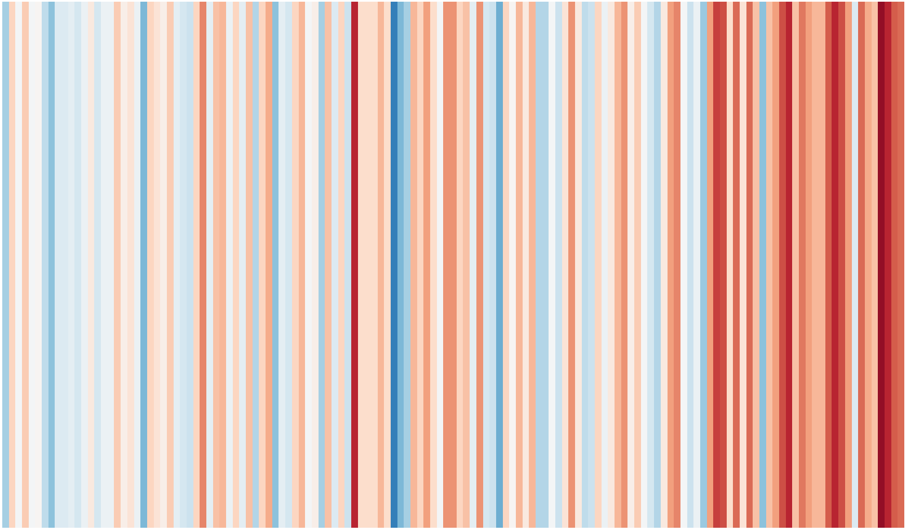
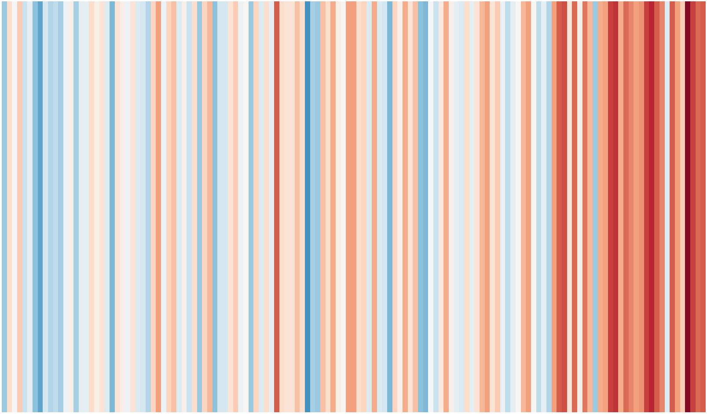

Inspired by the warming stripes by [Ed Hawkins](https://www.climate-lab-book.ac.uk/2018/warming-stripes/),
I used the data from the german weather service (DWD) and wrote a small script
to visualize the changes in temperature for Germany.

